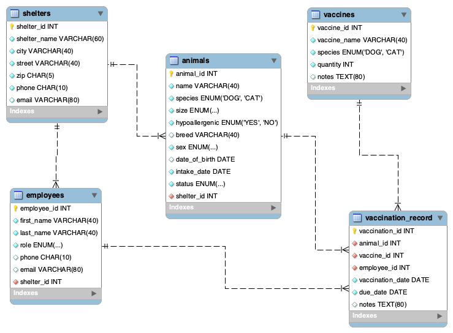

# Animal Shelter Management System

**Live Demo:**  
https://animal-shelter-app-project.streamlit.app/

**GitHub Repository:**  
https://github.com/mashasavo/animal-shelter-app

---

## Objective

To design and implement a database-driven application that manages animals, shelters, employees, vaccines, and vaccination records. The system comprises a normalized MySQL database and a Streamlit web application, utilizing CSV snapshots exported from MySQL for cloud deployment.
- This project was completed as part of the Database Theory and Applications course and is based on a real-world shelter workflow.

---

## Overview

This Animal Shelter Management System provides two main user perspectives:

### Guest View
- Browse animals  
- Filter by species, size, status, and shelter  
- View animal profiles and images  

### Staff View
- Add new animals  
- Update animal status  
- Delete animals  
- Review vaccine stock levels  
- View upcoming vaccinations  

Because Streamlit Cloud does not support SQL connections, the cloud version uses CSV snapshots.  
A production version would connect Streamlit directly to MySQL.

---

## Features

### Database Layer (MySQL)

- Five tables: `shelters`, `animals`, `employees`, `vaccines`, `vaccination_record.`
- Primary and foreign key constraints  
- ENUM validation for controlled fields  
- Indexes for filter-heavy columns  
- Trigger to automatically decrement vaccine stock  
- Stored view providing consolidated vaccination history  
- Advanced SQL:
  - Window functions  
  - Recursive CTE  
  - Joins  
  - Aggregation and grouping  
- SQL scripts validated in MySQL Workbench  

### Application Layer (Streamlit)

- Tab-based interface  
- Guest browsing with filters  
- Staff tools:
  - Add animals  
  - Update status  
  - Delete animals  
  - Vaccine stock overview  
  - Upcoming vaccinations  
- Card-style animal profiles with images  
- Loads CSV data from `data/` for cloud execution  

### Images

- Stored under `data/images/.`  
- Mapped to animals via naming conventions  
- Automatically displayed in the UI  

---

## Application Architecture

### Backend (MySQL)
- Normalized relational schema  
- Constraints, indexes, ENUMs  
- Trigger for stock updates  
- View for reporting  
- Intended as the authoritative data store  

### Data Pipeline
- MySQL → CSV exports  
- CSVs stored under `data/`  
- Streamlit Cloud loads CSVs due to lack of SQL support  

### Frontend (Streamlit)
- Python-based interface  
- Loads and displays CSV data  
- Renders animal cards, tables, dashboards, and images  
- Clear separation between guest and staff features  

---

## Entity-Relationship Diagram

Add your diagram using this line:

Ensure the file exists at the repository root.

---

## Included SQL Scripts

- [final_forward_engineer.sql](final_forward_engineer.sql) – Schema creation, constraints, relationships  
- [queries_advanced.sql](queries_advanced.sql) – Trigger, view, analytical SQL examples  

All SQL scripts were developed and validated in MySQL Workbench.

---

## Testing and Security

### Testing
- SQL scripts validated in MySQL Workbench  
- Streamlit app tested locally  
- Deployment tested in Streamlit Cloud  

### Security
Authentication is simplified for demonstration.

A production version would require:
- Secure credential storage  
- User authentication  
- Role-based access control  

---

## Deployment

### Running Locally

1. Create and populate the MySQL database using the provided SQL files.  
2. Install dependencies:

   pip install -r requirements.txt

3. Run the application:

   streamlit run app.py

### Streamlit Cloud Deployment

- Uses CSVs from the `data/` directory  
- Does not require a running MySQL server  

---

## Future Enhancements

- Full CRUD integration with live MySQL  
- Staff authentication and authorization  
- Direct image uploads  
- Cloud-based image storage  
- Automated vaccination reminders  
- Extended analytics  

---

## Author

Maria Savostianova  
University of Central Missouri  
Database Theory and Applications — Final Project

